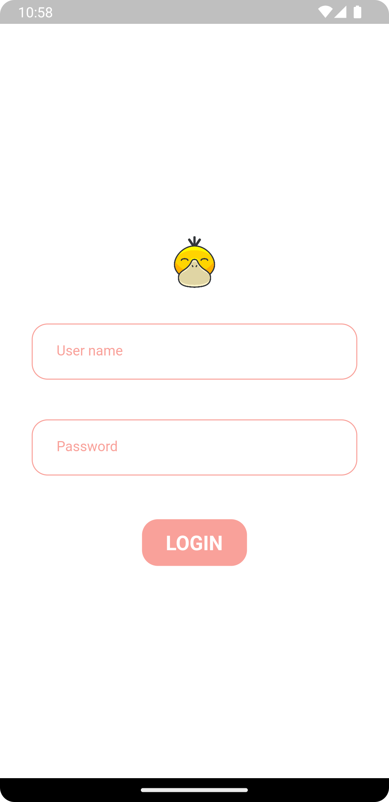
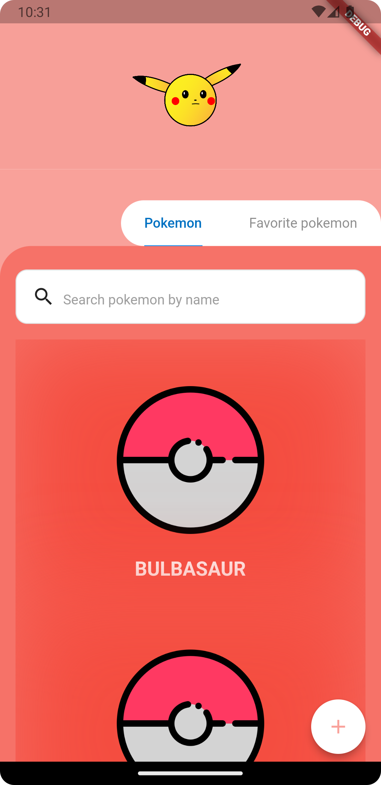
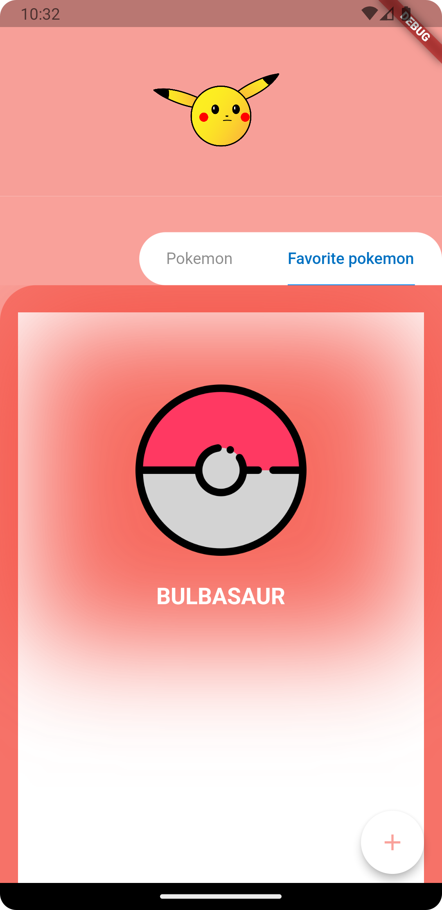
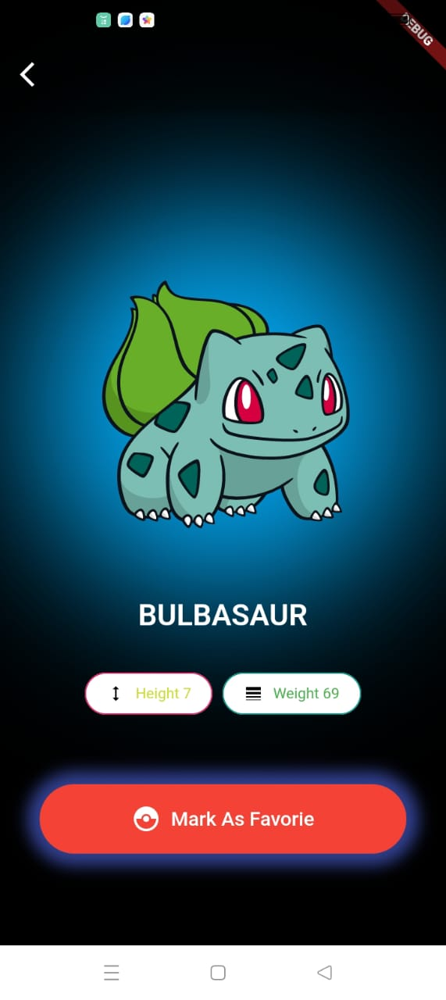
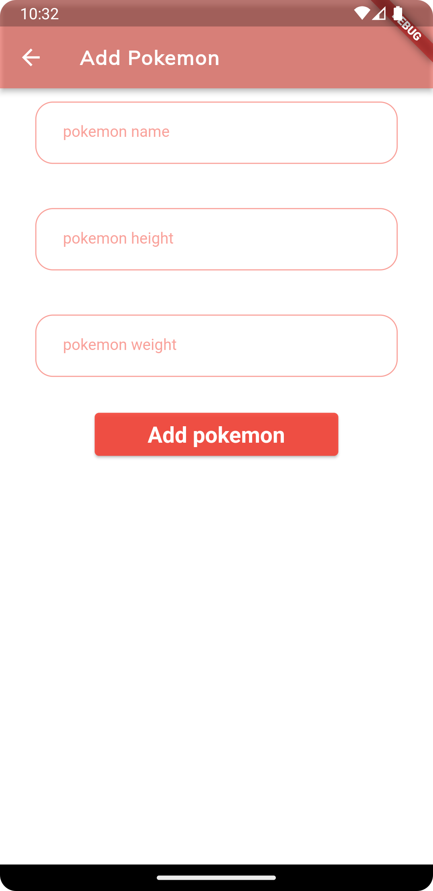

# POKEMON - Catch your next POKEMON

 Pokemon App to display initial list of pokemon further showing more information about a Pokemon when tapped.

### Bonus points:
  - An authentication screen to login with dummy user(if user logged in => redirects to homescreen)
  - Feature to save favorite Pokemon with separate screen to list them
  - Search for a pokemon using Pokemon id or name

### General points
  - An Infintite scrollable list for all the pokemons
  - A Pokemon detailed screen
  - Form to add new Pokemon 
  - App has support for dark theme
  - Used cubit for state management
  - Attractive & interactive UI
  - Clean code lines have been followed

## Dummy Data
- dummy username = "username"
- dummy password = "password"

## API 

Data is fetched from PokeAPI, check the link for documentation
https://pokeapi.co/docs/v2

## Peek view

 

   

  
  
   

